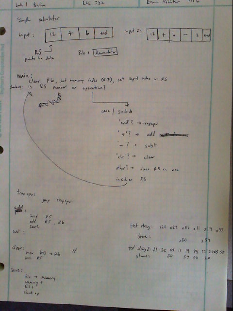
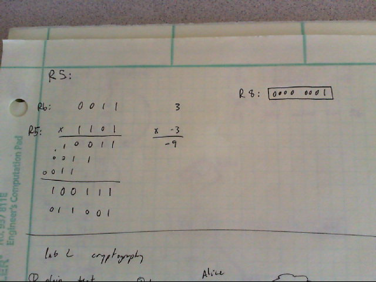
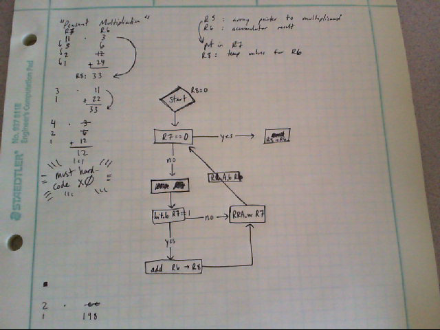

Simple Calculator Lab
===

Objectives & Purpose
---
This lab's objective is to give me practice in the assembly programming skills I have learned in class. Specific objectives include using the instruction set, addressing modes, conditional jumps, status register flags, assembler directives, and the assembly process effectively. The program I am implementing will take a series of operands and operations and store the results. It is a basic calculator that needs to implement add, subtract, clear, and end for minimum credit. For more credit, it will implement an upper- and lower-bound for overflow values, and a speedy multiply function.

Preliminary Design 
---



Software Flow-Chart / Algorithms
---
In this section, I discuss the general flow of my basic calculator program.

### Setup initial state

Storing operation identifiers and a test string into ROM with labels makes later code more readable.
```Assembly
plus:	.equ	0x11
minus:	.equ	0x22
times:	.equ	0x33
clear:	.equ	0x44
end:	.equ	0x55

input:	.byte	0x22, 0x11, 0x22, 0x55
```

After the normal boilerplate instructions, `main` initializes `R5` to point to the first byte in the test string, clears `R6` for use as the accumulator, and points `R7` to the first available space in RAM to store results: `0x0200`. Since the first value is always assumed to be a value, not an operation, `main` jumps to that command unconditionally.
```Assembly
main:
	mov.w   #__STACK_END,SP			; BOILERPLATE	Initialize stackpointer
	mov.w   #WDTPW|WDTHOLD,&WDTCTL 	; BOILERPLATE	Stop watchdog timer

	mov.w	#0x00, R6
	mov.w	#0x0200, R7
	mov.w	#input, R5

	jmp 	enternum

```
### Big-picture program flow

The largest portion of code is simply a **switch case** mechanism that loops until an `end` byte is encountered. Once an operation byte is identified, the operation is performed, and the result is stored by jumping to `save`; however `END_OP` jumps to trap the CPU once encountered.
```Assembly
checkend:
	cmp.b	#end, 0(R5)
	jnz		checkplus
	jmp		trapcpu

checkplus:
	cmp.b	#plus, 0(R5)
	jnz		checkminus
	;ADD_OP
	jmp		save

checkminus:
	cmp.b	#minus, 0(R5)
	jnz		checktimes
	;SUB_OP
	jmp		save

checktimes:
	cmp.b	#times, 0(R5)
	jnz		checkclear
	;MUL_OP
	jmp		save

checkclear:
	cmp.b	#clear, 0(R5)
	jnz		enternum
	;CLR_OP
	jmp		checkend

enternum:
	mov.b	@R5+, R6
	jmp		checkend
```

### A glance at `MUL_OP`
I will briefly discuss my implementation of a multiplication function.

My first strategy was to implement multiplication in a similar way to how I would do it by hand.


I had trouble figuring out an algorithm that would accomplish that, so I investigated [Peasant Multiplication](http://en.wikipedia.org/wiki/Multiplication_algorithm#Peasant_or_binary_multiplication) as suggested by [C2C Eric Wardner](https://github.com/EricWardner). Upon later inspection, I realize that it is exactly the same process as multiplying binary numbers by hand. This was a good resource to better visualize and understand the concept. I came up with the following algorithm:
*note: I didn't need to hard-code multiply by zero after all*



```Assembly
checktimes:
	cmp.b	#times, 0(R5)
	jnz		checkclear
	inc.w	R5
	push.w	R7						; preserve R7
	mov.w	#0x00, R7
	mov.b	@R5+, R7
	mov.w	#0x00, R8				; R8 holds the final answer as R6 doubles
checkdone:
	cmp.w	#0x00, R7
	jz		done
	bit.b	#0x1, R7				; checks even-ness of R7
	jz		even
	add.w	R6, R8
even:
	rra.w	R7						; R7 halves
	rla.w	R6						; R6 doubles
	jmp		checkdone
done:
	pop.w	R7
	cmp.w	#0x100, R8				; R8 < 0x100?
	jl		goodmult				; yes: goto goodmult
	mov.w	#0xFF, R8				; no: product was too big
goodmult:
	mov.w	R8, R6
	jmp		save
```

Debugging & Testing
---
### Method
When debugging my program, I would run test cases that tested the particular operation I was working on. Setting a breakpoint to the first instruction of the operation would pause the execution at an appropriate time. I had the register window and the memory browser open at all times as I stepped through the program. I would fill the RAM to `0xAA` so that new values would stand out in red.


Conclusion & Lessons Learned
---


Documentation
---
I referenced C2C Taylor Bodin's [lab 1 notebook](https://github.com/taylorbodin/ECE382_Lab1/blob/master/README.md) to see formatting of the `readme.md` markdown file, and the general flow of the lab report.
