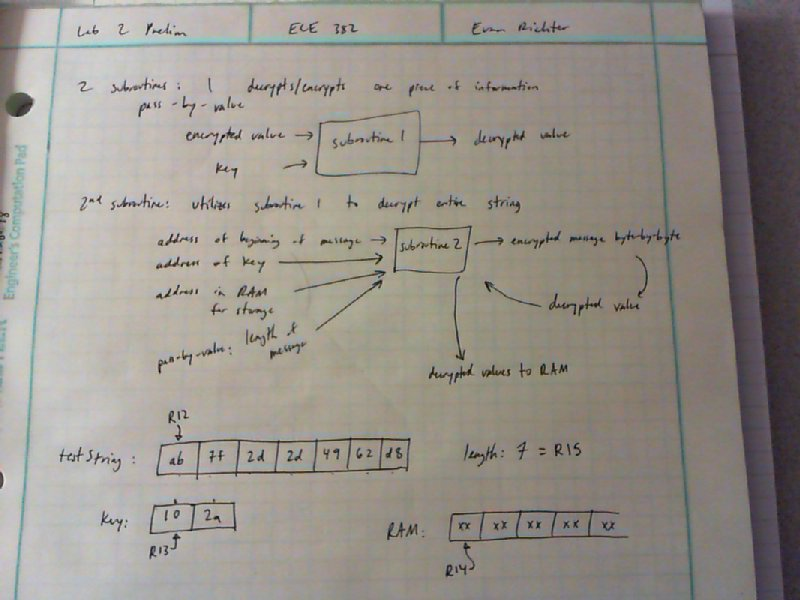

Subroutines & Cryptography Lab
===

Objectives & Purpose
---
The objective for this lab is to practice assembly code programming skills, specifically writing and working with subroutines. Two subroutines are required: one will implement pass-by-value and one will use pass-by-reference. The problem is to decrypt a string of cipher text that had been encoded with XOR. My three tasks are to decrypt cipher text of arbitrary length with a key:

1. of length 1 byte
2. of length multi-byte
3. that is unknown

The plain text will be in ASCII format, stored in RAM. The MSP430 will be used for all requirements except (optionally) for finding the plain text in A functionality.

Preliminary Design 
---
This section shows my initial stab at solving the problem. It is the step of conceptualization that took me from theory to implementation.



The handwritten visualization above was enough for me to write up a pseudocode implementation of B funtionality. Using this work, I went straight to implementing the B functionality in assembly.

```
const char [] cryptText = 0x11, 0x22, 0x34 ...

void main() {
	//setup initial values
	traverseString();
}

char decryptByte(cryptByte R8, key R9) {
	xor.b R9, R8
	return plainByte R8
}

void traverseString(msgStart* R11, ramStart* R12, msgLength R13, key* R14, keyLength R15) {
	push R8, R9, R11, R12, R13, R14, R15
	
	for (; R13 > 0; R13-- R15--) {
		mov.b @R11+, R8
		if (R15 == 0) {
			pop R15
			pop R14
			push R14
			push R15
			mov.b @R14+, R9
		}
		decryptByte(R8, R9)
		mov.b R9, 0(R12)
		inc.w R12
	}
	
	pop R15, R14, R13, R12, R11, R9, R8
	return
}
```

Software Flow-Chart / Algorithms
---
In this section I will discuss the general purposes and utility of the subroutines that worked to solve the problem.

### Program Overview
The big picture of my program is two subroutines. One takes a byte of cipher text and a key, and returns a plain text byte; the other takes parameters to direct the decryption of the entire message. The only thing `main` needs to do is set the parameters for `decryptMessage` and then call `decryptMessage`.

### A look at `decryptByte`
Register | Parameters | Output
:------: | :--------: | ------
R8       | encrypted byte | decrypted byte
R9       | key | 

The function of `decryptByte` is elementary, but abstracting it for use by other subroutines was important. This subroutine was a one-liner, making use of the `xor.b` assembly command for the MSP430.

### A look at `decryptMessage`
Register | Parameters | Output
:------: | :--------: | ------
R11      | keyLength  | 
R12      | msgStart*  | 
R13      | ramStart*  | 
R14      | msgLength  | 
R15      | key*       | 

#### protecting registers
The first thing this subroutine does is protect the original values of the input parameters by using the stack. It pushes `R15` and `R11` last because it will need to recover those values for continued function of the subroutine. It also pushes `R8` and `R9` because they will are modified to interface with the `decryptByte` subroutine.

```
decryptMessage:
	push.w	R8
	...
	push.w	R15
	push.w	R11
```

At the end of the subroutine, every register that was `push`ed on the stack is then `pop`ped off the stack in reverse order. This restores the registers to their state before this subroutine was called.

#### a loop within a loop
Each byte in the crypt text needs to be touched. One loop in `decryptMessage` handles this simply by using the `msgLength` variable as a counter approaching zero. `msgLength` is decremented every time after the byte is decrypted.

```
checkEndString:
	cmp.w	#0, R14
	jeq		endString
```

Similarly, each byte needs to have a key before decryption can happen. A loop within `checkEndString` handles this by using `keyLength` as a decremented counter. The keys we are dealing with are all smaller in length than the message. This means the key has to loop over itself multiple times. The most recent items on the stack are conveniently `keyLength` and `key*` specifically for this purpose. The following code snippet just restores the counter used to iterate over the key, and the original key pointer.

```
	cmp.w	#0, R11
	jne		endKey
		pop.w	R11
		pop.w	R15
		push.w	R15
		push.w	R11
```

#### decrypting a byte
This is the simplest part of the subroutine. The following needs to happen:

1. load the crypt byte and key
2. decrement the length counters
3. call `decryptByte`
4. store result in memory

All of that is done in this code, before moving to the next byte.

```
	mov.b	@R12+, R8
	mov.b	@R15+, R9
	dec.w	R11
	dec.w	R14
	call	#decryptByte
	mov.b	R8, 0(R13)
	inc.w	R13
	jmp	endString
```

### A Functionality
The code dicussed above is functional for any XOR encryption or decryption problem with variable key length. What is discussed below only pertains to finding the plain text message from a crypt text with unknown key.

Known | Unknown
:---: | :---:
message length | key
contains: ' ', '.', a-z, or A-Z | 
ASCII encoded | 
16-bit key length | 

I modified `main` to iterate over every key from `x0000` to `xffff` and return a list of valid keys.

Register | Purpose
------- | ------
R15 | pointer to RAM where valid keys are stored
R10 | validity of key `x0000` = valid, `xffff` = not valid

This required modifying `decryptMessage` to return an error if an invalid character was found. After decrypting the byte, the result is checked for the ASCII characters: space, period, and the set of uppercase and lowercase letters.

```
	cmp.b	#0x20, R8
	jeq		goodChar
	cmp.b	#0x2e, R8
	jeq		goodChar
	cmp.b	#0x41, R8
	jl		badChar
	cmp.b	#0x5b, R8
	jge		checkMid
	jmp		goodChar
checkMid:
	cmp.b	#0x61, R8
	jl		badChar
	cmp.b	#0x7b, R8
	jge		badChar
	jmp		goodChar
```
If the result was a valid character, the decryption proceeds to the next byte. If not, the process stops and `R10` is set to the error message `xffff`.

```
goodChar:
	jmp		checkEndString
badChar:
	mov.w	#0xFFFF, R10
	jmp		endString
```

This gave me only one possible key: `x73be` which produced the text
> Fast. Neat. Average. Friendly. Good. Good.

Debugging & Testing
---
When finding the plain text of the A functionality string, I thought a character frequency test on the space character, ASCII `0x20`, would be a good place to start. This didn't work out, however, because in the message itself, the frequency of the period character was higher. I changed my approach to the one above after trying the possible keys that the first algorithm gave me.

Conclusion & Lessons Learned
---
In this lab I learned that often solving only a *subset* of a problem will speed up the design and implementation of the whole solution.


Documentation
---
I used Paul Schou's online binary translator to check my results. [xlate](http://paulschou.com/tools/xlate/)
