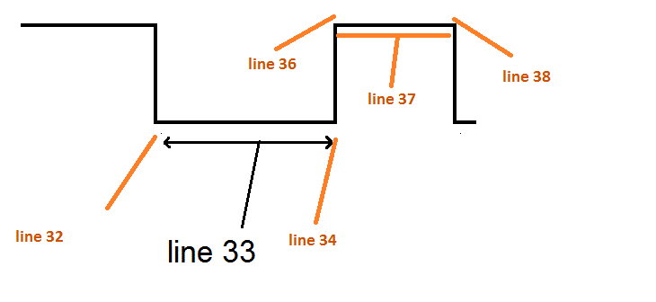
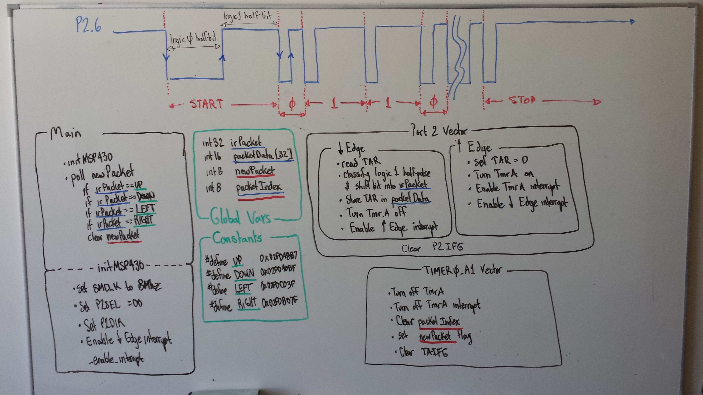

Remote Control Decoding with Interrupts Lab
===

Objectives & Purpose
---
In this lab I will use interrupts from the Timer_A subsystem and an infrared detector to decode signals from an infrared remote control.

Day 1 - Timing Pattern of the Remote
---
On day one I used an O-scope with holdoff functionality to manually decode the remote's output for various button presses. I connected the IR receiver to a protoboard so I could read the signals on the scope without interfering with the MSP430. The MSP430 was loaded with `test5.c`, a debugging program that recorded the number of timer counts for each logic high and low received on pin 2.6. The Timer_A configuration used in this file (`TACTL = ID_3 | TASSEL_2 | MC_1;`) yielded a rollover time of 16ms, and each count was 64us.



The timing duration (measured by the scope) and the corresponding counts are listed in the following table. I noticed that the logic 0 half-pulse on both data 1 and data 0 bits were very similar. I noted that the best way to differentiate between a 0 and a 1 would be with the logic 1 half-pulse (which is actually when the remote is not transmitting). It makes sense for the remote control engineers to implement a binary signal in this manner, because it minimizes transmitting time and extends battery life.

|           Pulse           | Duration (ms) | Timer A counts |
|:-------------------------:|:-------------:|:--------------:|
|  Start logic 0 half-pulse |       9       |      8895      |
|  Start logic 1 half-pulse |      4.5      |      4407      |
| Data 1 logic 0 half-pulse |      0.6      |     560-594    |
| Data 1 logic 1 half-pulse |      1.65     |    1620-1650   |
| Data 0 logic 0 half-pulse |      0.6      |     560-594    |
| Data 0 logic 1 half-pulse |      0.55     |     523-530    |
|  Stop logic 0 half-pulse  |      0.6      |       595      |
|  Stop logic 1 half-pulse  |   108 (long)  |  40521 (long)  |

Reading the signal from the scope, I found the following codes corresponded to button presses. I recorded the PLAY code three times to make sure it didn't change between key presses.

| Button | Code (hexadecimal) |
|:------:|:------------------:|
|    0   |       1de00ff      |
|    1   |       1de807f      |
|    2   |       1de40bf      |
|    3   |       1dec03f      |
|  POWER |       1dec837      |
|  PLAY  |       1de6897      |
|  STOP  |       1dee817      |
|   FFW  |       1de18e7      |
|   REW  |       1de9867      |

Day 2 - Functionality
---

Having successfully reverse engineered the remote control, I was able to re-purpose it to control LED input and output. The image below shows the outline of my program's flow, driven almost entirely by interrupts.



### Receiving an IR Packet

When P2.6 drops low, it is beginning to receive an IR signal, and the following code fires:

```
pulseDuration = TAR;
packetData[packetIndex++] = pulseDuration;
if (pulseDuration < minLogic0Pulse);
else if (pulseDuration < maxLogic0Pulse){
	irPacket = irPacket<<1;
	irPacket = irPacket & 0xFFFFFFE;
}
else if (pulseDuration < minLogic1Pulse);
else if (pulseDuration < maxLogic1Pulse){
	irPacket = irPacket<<1;
	irPacket = irPacket | 0x1;
}
else if (pulseDuration < minStartPulse);
else if (pulseDuration < maxStartPulse){
	irPacket = 0;
	packetIndex = 0;
}

TACTL = 0;
LOW_2_HIGH;
break;
```

A negative edge means that the time spent in logic 1 is ready to be measured and classified as a start bit, data 0, data 1 (the Timer_A overflow flag determines the end of a packet). The code segment also handles compiling the 1s and 0s into a complete packet, stored in `irPacket`. The end of that code turns off the timer, stopping the counting.


The next code segment runs when a positive edge on P2.6 is detected. It starts the `TAR` at 0 so that the length of the logic 1 is measured. `Timer_A` is started, and the next interrupt to be triggered is set to be a negative edge.

```
TAR = 0x0000;
TACTL = ID_3 | TASSEL_2 | MC_1 | TAIE;
HIGH_2_LOW;
break;
```

When the remote stops transmitting a packet, it simply stops. There is no "end bit". To be sure that `irPacket` isn't given extra bits from the next packet, the `TACCR0` was set to about 10ms. When the `Timer_A` flag, `TAIFG`, is set, the interrupt calls the following code which stops the timer, and sets the `newIrPacket` flag.

```
TACTL = 0;
packetIndex = 0;
newIrPacket = TRUE;
```

### Decoding an IR Packet

This section of code is a very simple case-switch that is run whenever an IR packet is received. The global constants are defined in `start5.h`, and correspond to the table above.

*start5.h snippet*
```
#define		PWR		0x01dec837
#define		ZER		0x01de00ff
#define		ONE		0x01de807f
#define		TWO		0x01de40bf
#define		THR		0x01dec03f

#define		FFW		0x01de18e7
#define		RRW		0x01de9867
#define		PLY		0x01de6897
#define		STP		0x01dee817
```

*start5.c snippet*
```
if (newIrPacket) {
	switch (irPacket) {
		case PLY:
			//turn on LED1
			P1OUT |= BIT0;
			break;
		case STP:
			//turn off LED1
			P1OUT &= ~BIT0;
			break;
		case PWR:
			//do stuff
			break;
		case FFW:
			//turn on LED2
			P1OUT |= BIT6;
			break;
		case RRW:
			//turn off LED2
			P1OUT &= ~BIT6;
			break;
		case ZER:
			//do stuff
			break;
		case ONE:
			//do stuff
			break;
		case TWO:
			//do stuff
			break;
		case THR:
			//do stuff
			break;
	}
	newIrPacket = FALSE;
	irPacket = 0;
}
```

### Functionality video

<a href="http://www.youtube.com/watch?feature=player_embedded&v=Q5xAEBiSjDQ" target="_blank"></a>
