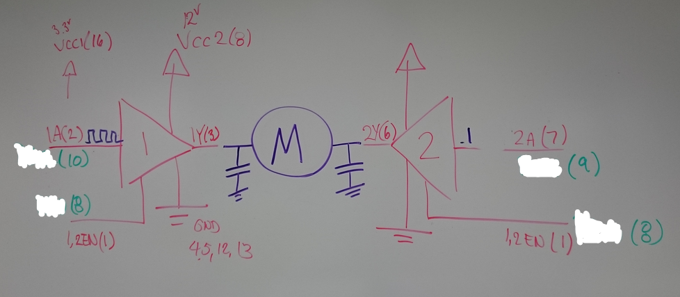
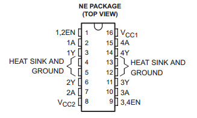

Lab 6 - PWM & Robot Movement
===

Prelab
---

Consider your hardware (timer subsystems, chip pinout, etc.) and how you will use it to achieve robot control. Which pins will output which signals you need? Which side of the motor will you attach these signals to? How will you use these signals to achieve forward / back / left / right movement? Spend some time here, as these decisions will dictate much of how difficult this lab is for you.

Timer A1 will be my PWM control because of its built-in ability to drive P2.2 with TA1CCR1 and P2.4 with TA1CCR2. Register TA1CCR0 controls the period for both. A PWM signal will be connected to one lead of each motor, and the other lead will be connected to GPIO pins that will designate direction of motion. The enable pin on the SN754410 motor driver chip will also be hooked up to a GPIO pin on the MSP430, and will turn the motor on or off.

| MSP430 Pin |        Function       |
|:----------:|:---------------------:|
|    P2.0    |   Left Motor Enable   |
|    P2.1    |  Left Motor Direction |
|    P2.2    |     Left Motor PWM    |
|    P2.3    |   Right Motor Enable  |
|    P2.4    |    Right Motor PWM    |
|    P2.5    | Right Motor Direction |

The following whiteboard drawing, courtesy of Dr. Coulston, shows my general plan for motor hookup. This will be done twice, one for the right motor and one for the left. The capacitors are to help reduce electrical noise from the motors.



This diagram is of the SN754410, the motor driver.



### Control Scheme

To interface with my robot, I will utilize IR input from a remote control according to the control scheme below. The IR decoding subsystem uses Timer A0, so it won't interfere with PWM control.

![] (./images/control_plan.png "Control Scheme")

The following switch statement will provide this type of movement.
```
switch (irPacket) {
	case ZERO:
		//do stuff
		break;
	case ONE:
		//accelerate left motor
		leftDirection = accelerate(&leftPWM, leftDirection);
		break;
	case TWO:
		//accelerate both motors
		leftDirection = accelerate(&leftPWM, leftDirection);
		rightDirection = accelerate(&rightPWM, rightDirection);
		break;
	case THREE:
		//accelerate right motor
		rightDirection = accelerate(&rightPWM, rightDirection);
		break;
	case FOUR:
		//stop left motor
		leftPWM = 0;
		break;
	case FIVE:
		//stop both motors
		leftPWM = 0;
		rightPWM = 0;
		break;
	case SIX:
		//stop right motor
		rightPWM = 0;
		break;
	case SEVEN:
		//decelerate left motor
		leftDirection = decelerate(&leftPWM, leftDirection);
		break;
	case EIGHT:
		//decelerate both motors
		leftDirection = decelerate(&leftPWM, leftDirection);
		rightDirection = decelerate(&rightPWM, rightDirection);
		break;
	case NINE:
		//decelerate right motor
		rightDirection = decelerate(&rightPWM, rightDirection);
		break;
}
```
