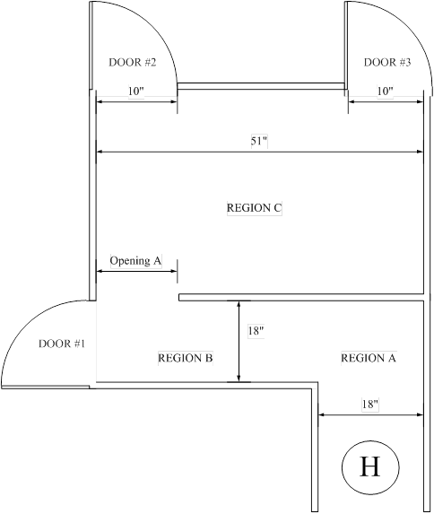
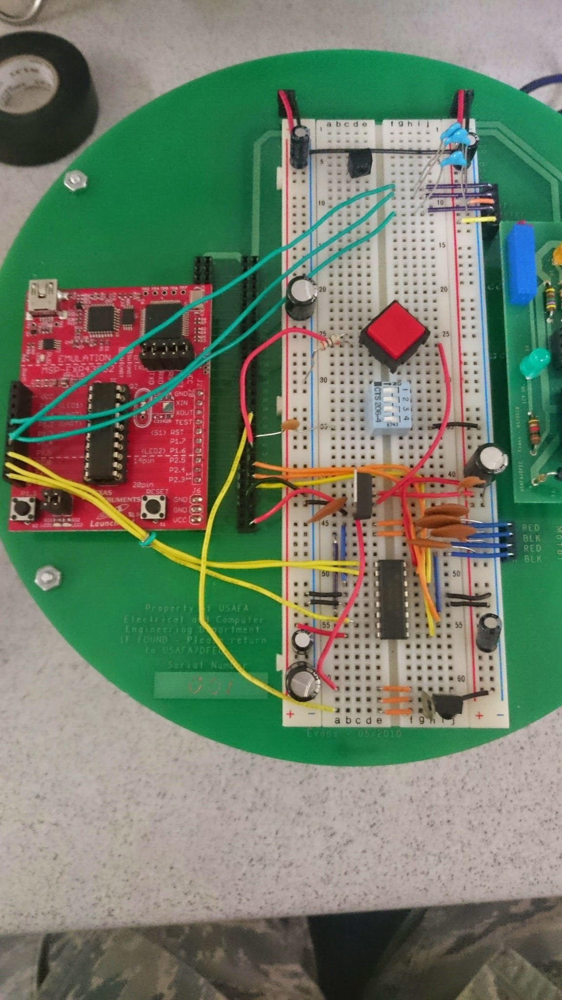

Lab 8 - Robot Maze
===

Objective
---
To be the fastest robot through the maze without hitting any walls



Strategy
---
Though my strategy changed and evolved as I spent more time hands on with the robot, the overall concept stayed the same. I took Dr. Coulston's advice and operated my robot like a state machine. The first state is the straight path then left turn. The next stage begins when the robot loses the right wall, entering the "horseshoe turn". The last state is much the same as the first: straight then left, however there is no need to watch out for the horseshoe. So I broke up the maze into three states that Doomba had to recognize and successfully navigate.

On a lower level, my strategy for sensing walls was different than the other competitors. Most had a gradient of `#define`d values they would check for and make decisions from. I chose to use a big red button (see wiring picture below) to calibrate the sensors *every time the robot started up*. This eliminated the variations of sensor inputs based on room lighting, temperature, shadows (for the most part), and even different reflective properties of the walls in different mazes.

The basic movement pattern for Doomba was

1. Read sensors
2. Move according to location in maze
3. Where am I?
4. Update state if necessary

Implementation
---
### Wiring
Doomba was wired as shown below. Notable features include:

1. The big red calibration button
2. The neat wiring
3. The multitude of capacitors to clean up the supply voltages



### Code
To not be thrown off by random large sensor readings, I avereged 16 sensor readings at a time. A for loop iterates 16 times, each time adding the appropriate sensor reading to `leftSum`, `centerSum`, and `rightSum`. In retrospect, it was unnecessary to divide by 16 at the end, because an `int16` is able to hold the sum.

```
void getSensors(void){
	int16 leftSum = 0;
	int16 centerSum = 0;
	int16 rightSum = 0;

	int8 i = 0;
	for (;i<16;i++){
		ADC10CTL0 = 0;
		ADC10CTL1 = INCH_2 | ADC10DIV_3 ;
		ADC10AE0 = BIT2;
		ADC10CTL0 = SREF_0 | ADC10SHT_3 | ADC10ON | ENC;
		ADC10CTL0 |= ADC10SC;
		while(ADC10CTL1 & ADC10BUSY);
		leftSum += ADC10MEM;

		ADC10CTL0 = 0;
		ADC10CTL1 = INCH_3 | ADC10DIV_3 ;
		ADC10AE0 = BIT3;
		ADC10CTL0 = SREF_0 | ADC10SHT_3 | ADC10ON | ENC;
		ADC10CTL0 |= ADC10SC;
		while(ADC10CTL1 & ADC10BUSY);
		centerSum += ADC10MEM;

		ADC10CTL0 = 0;
		ADC10CTL1 = INCH_4 | ADC10DIV_3 ;
		ADC10AE0 = BIT4;
		ADC10CTL0 = SREF_0 | ADC10SHT_3 | ADC10ON | ENC;
		ADC10CTL0 |= ADC10SC;
		while(ADC10CTL1 & ADC10BUSY);
		rightSum += ADC10MEM;
	}

	leftDistance = leftSum >> 4;
	centerDistance = centerSum >> 4;
	rightDistance = rightSum >> 4;
}
```

Next are the function declarations for moving Doomba at an abstracted level. I found this more useful because I could think in amore abstract way, and `main()` wasn't cluttered with low level motor control. These are just a sampling of the movement definitions. Everytime a battery died and was replaced, the hardcoded values had to change as well. I think a better approach to the battery replacement dilemma would have been to set the following hardcoded numbers as multiples of a global variable that calibrated the "zippiness" of a new battery. That way only one value would have to be recalibrated after swapping batteries.

```
void doombaJustWaitaLittle(void) {
	__delay_cycles(600000);
}

void doombaJustWait(void) {
	doombaJustWaitaLittle();
	doombaJustWaitaLittle();
}

void doombaStop(void) {
	rightMotor = 0;
	leftMotor = 0;
	updatePWM();
	doombaJustWaitaLittle();
}

void doombaBackup(void) {
	rightMotor = -16;
	leftMotor = -16;
	updatePWM();
	doombaJustWaitaLittle();
}
```

The following code simply operates the red and green onboard LEDs on the MSP430. It was simple but incredibly helpful in debugging. I could "see" what Doomba was thinking and anticipate his next move.

```
void blinkLED(int16 mask) {
	int8 i = 0;
	for(;i<15;i++){
		P1OUT &= ~mask;
		__delay_cycles(200000);
		P1OUT |= mask;
		__delay_cycles(200000);
	}
}
void testWall(void){
	getSensors();
	if (centerDistance > centerTarget ) {
		P1OUT |= BIT0;
	} else {
		P1OUT &= ~BIT0;
	}

	if (rightDistance > rightTarget + R_THR) {
		P1OUT &= ~BIT6;
	} else if (rightDistance > rightTarget - R_THR) {
		P1OUT |= BIT6;
	} else if (rightDistance < rightNoWall) {
		blinkLED(BIT6);
	} else {
		P1OUT &= ~BIT6;
	}
}
```

The next code block starts out my `main()` function. Right after `initMSP430()` it waits for me to move the robot in place and push the red button to signify a target distance from the right wall, a minimum distance from a front wall, and what the "abyss" looks like in the horseshoe part of the maze.

```
initMSP430();		// Setup MSP to process IR and buttons

while (BUTTON);
while (!BUTTON);
getSensors();
rightTarget = rightDistance;	//calibrate right wall
blinkLED(BIT6);
while (BUTTON) testWall();
while (!BUTTON) testWall();
getSensors();
centerTarget = centerDistance + 0x25;	//calibrate front wall
blinkLED(BIT0);
while (BUTTON) testWall();
while (!BUTTON) testWall();
getSensors();
rightNoWall = rightDistance + R_THR;	//calibrate front wall
blinkLED(BIT6);

while (BUTTON) testWall();
while (!BUTTON) testWall();
```

Analysis & Conclusion
---
Overall, I think the frustrations I experienced could have been mitigated had I thought of the single, global, battery calibration variable sooner than the final day. I wasted around 3 hours in total just recalibrating the motor movements for different batteries. As for things that I could improve upon, the next biggest one would have to be a stop command from the remote control. I have the IR receiver code on lock, and setting that up would have been simple.

I could also have used the left sensor. I noticed that the robots that utilized all three were faster through the maze, where Doomba would be afraid of venturing too far away from the right wall.
